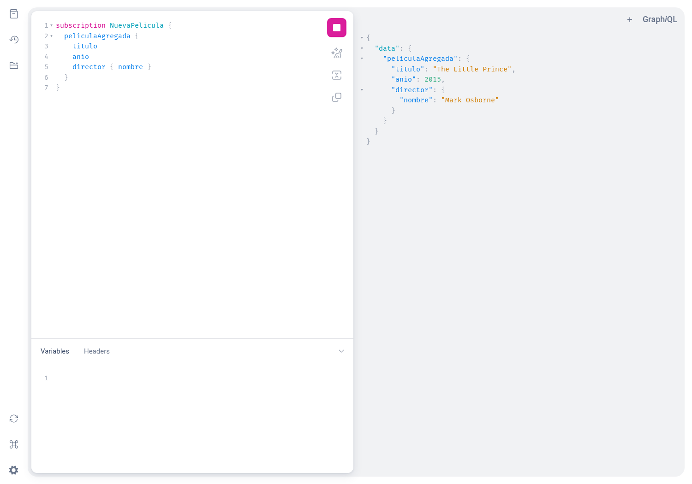
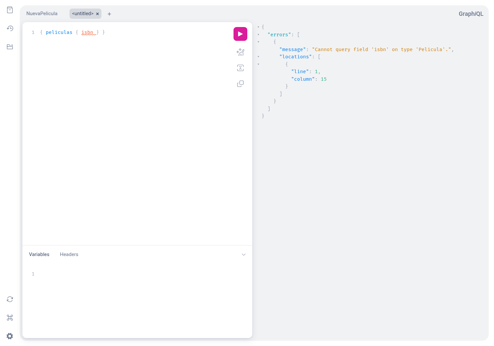
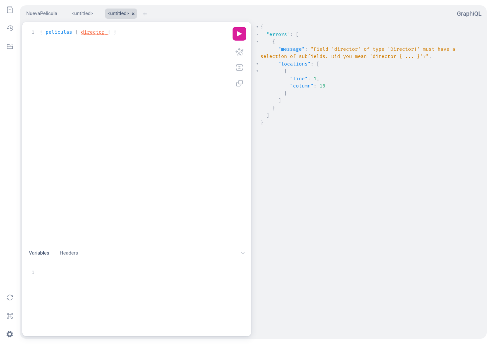
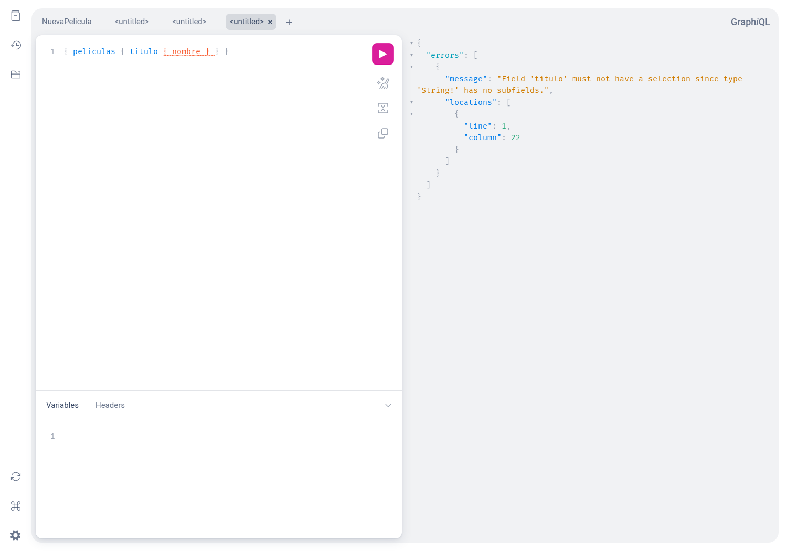
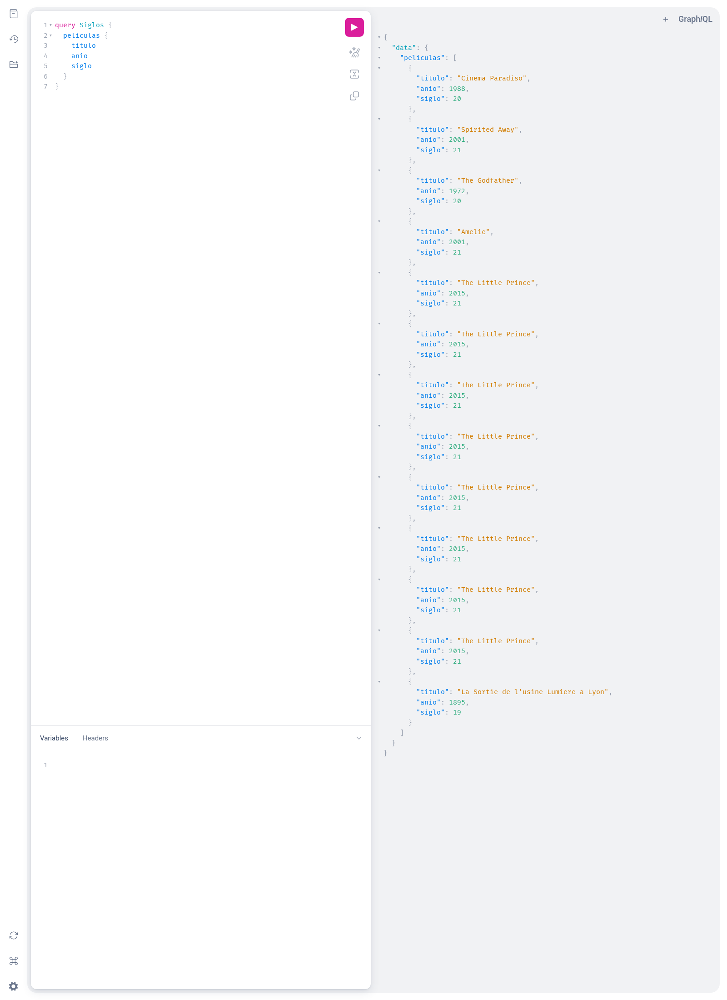
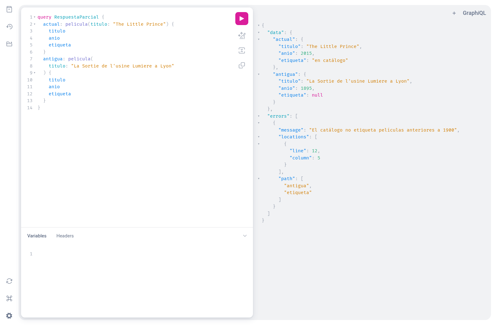
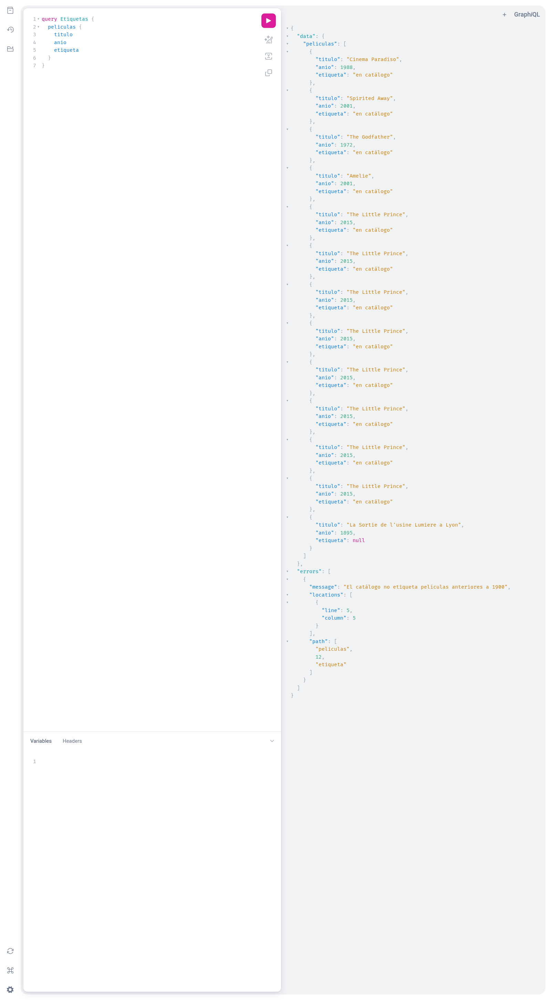
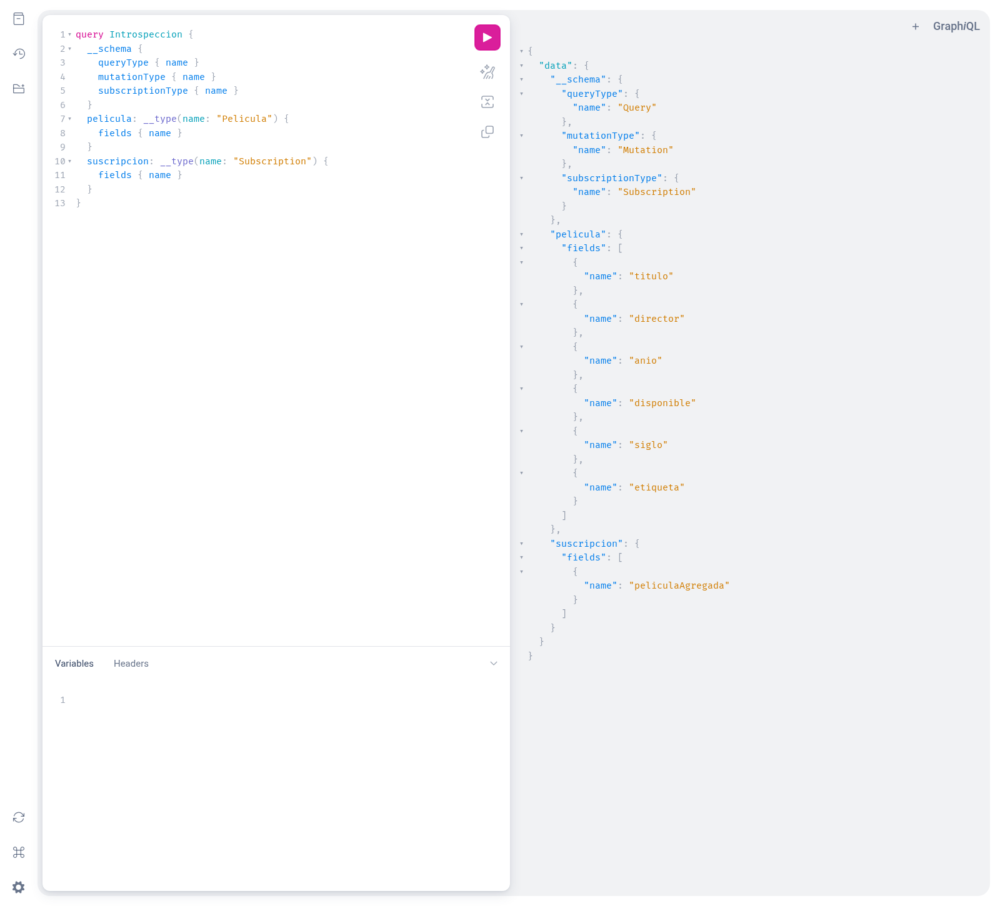

# Evidencias · Unidad II · Actividad 2

Capturas reales de GraphiQL ejecutando el cineclub contra MySQL. Las evidencias de la actividad 1 están en la carpeta superior.

## 1. Suscripción

La conexión WebSocket recibe The Little Prince después del commit, sin volver a consultar y sin reenviar las películas anteriores.

## 2. Validación

La petición se detiene en validación: `isbn` no existe en Pelicula; la respuesta contiene `errors` y no contiene `data`.

Un objeto como `director` requiere seleccionar sus subcampos; la validación rechaza la consulta antes de ejecutar resolvers.

Un escalar como `titulo` no admite una selección interna; el servidor devuelve un error de petición.

## 3. Ejecución

El resolver `siglo` calcula el siglo con el año de cada película durante la ejecución, sin una columna adicional en MySQL.

## 4. Respuesta parcial

Durante la ejecución, `etiqueta` falla para la película de 1895: queda null, pero título, año y los datos de la película de 2015 permanecen en `data`; `errors` identifica el campo que falló.

La primera captura usa dos búsquedas por título para facilitar la comparación. La siguiente muestra la lista completa, que también se conserva en `lista_parcial` de [resultados.json](resultados.json).

## 5. Introspección

La consulta del esquema confirma las raíces Query, Mutation y Subscription, los campos calculados y la suscripción `peliculaAgregada`.

[Respuestas JSON reales de todas las comprobaciones](resultados.json).
